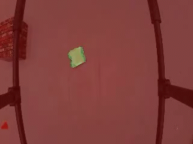
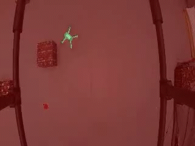
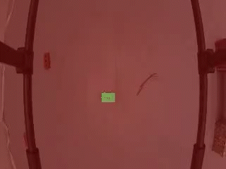

# Follow Anything
**[📰 Paper](https://arxiv.org/abs/2308.05737)** | **[📹 Explainer Video](https://www.youtube.com/watch?v=6Mgt3EPytrw)**
#### *Follow Anything:* Open-set detection, tracking, and following in real-time.


🏛️ **[1 CSAIL, MIT](https://www.csail.mit.edu/)**  | **[2 SEAS, Harvard](https://www.csail.mit.edu/](https://seas.harvard.edu/)https://seas.harvard.edu/)**

✍️ *[Alaa Maalouf](https://www.csail.mit.edu/person/alaa-maalouf), [Ninad Jadhav](https://react.seas.harvard.edu/people/ninad-jadhav), [Krishna Murthy Jatavallabhula](https://krrish94.github.io/), [Makram Chahine](https://www.mit.edu/~chahine/), [Daniel  M.Vogt](https://www.danielmvogt.com/), [Robert J. Wood](https://wyss.harvard.edu/team/associate-faculty/robert-wood/), [Antonio Torralba](https://groups.csail.mit.edu/vision/torralbalab/), and [Daniela Rus](https://danielarus.csail.mit.edu/)* ✍️


*FAn* - Follow Anything is a robotic system to detect, track, and follow any object in real-time while accounting for occlusion and object re-emergence. 
*FAn* is an open-vocabulary and multimodal system -- it is not restricted to concepts seen at training time and can be initialized/queried using text, images, or clicks.  

## 📹 Demo Videos

1. Car following and re-detecting: 
<p align="center">

 

2.  Drone following:
<p align="center">
 
 
</p>

3. Manually moving brick following and re-detecting:
<p align="center">

 
</p>


## 🤔 FAn approach


An input frame of $4$ whales with a click query on a whale and click query on water. 

   1. In the first step, SAM extracts multiple masks (segmentations), then, 

   2. based on DINO features (for text queries we use CLIP, and for audio queries, we could use AudioCLIP), FAn classifies each mask to what object it          refers to from the given queries (water/whales).

   3. Finally, whales are detected by assigning the masks whose DINO feature descriptor is closest to the whales' query feature descriptor. 

NOTE: The heat maps are shown in the click (query figures).

## Automatic re-detection


FAn supports Automatic re-detection via cross-trajectory stored ViT features.

1. At every frame, FAn stores the DINO features representing the tracked object. 

2. Once the object is lost, FAn either applies a segmentation model or gets suggested masks from the tracker.

3. For every mask, FAn computes the DINO/CLIP descriptors, and 

4. Compares it to the pre-computed ones.

   a. If a high similarity is obtained:  keep tracking the object,

   b. else" GOTO step (3) again on the next frame.

## Installation
The code was tested with `python=3.9.12`, as well as `pytorch=1.9.0+cu102` and `torchvision=0.10.0+cu102`. 

Please follow the instructions [here](https://pytorch.org/get-started/locally/) to install both PyTorch and TorchVision dependencies. Installing both PyTorch and TorchVision with CUDA support is strongly recommended.

1. Clone the repository locally:

```

 git clone https://github.com/alaamaalouf/FollowAnything.git

```

 2. Install the directory Segment-and-Track-Anything as explained in: https://github.com/z-x-yang/Segment-and-Track-Anything

    Then, download:

         a. SAM model to Segment-and-Track-Anything/ckpt directory, the default model is SAM-VIT-B (sam_vit_b_01ec64.pth).

         b. DeAOT/AOT model to Segment-and-Track-Anything/ckpt directory, the default model is R50-DeAOT-L (R50_DeAOTL_PRE_YTB_DAV.pth).


    Note - some files are slightly modified in the directory Segment-and-Track-Anything, hence, use the version provided in this directory.
    

 4. If you wish to use SiamMask as a tracker (default is AOT from step "2") install SiamMask as detailed in: https://github.com/foolwood/SiamMask


 5. pip install mavsdk (you may need to do more simple pip installs for other libraries).


## Example Commands

1. ```
   python follow_anything.py --desired_height 240 --desired_width 320 --path_to_video example_videos/car_following.avi --save_images_to outputs/ --detect dino --redetect_by tracker --use_sam --tracker aot --queries_dir queries/toy_car_following --desired_feature 0 --plot_visualization
   ```
3. ```
   python follow_anything.py --desired_height 240 --desired_width 320 --path_to_video example_videos/brick_following.avi --save_images_to outputs/ --detect dino --use_sam --tracker aot --queries_dir queries/brick_following/ --desired_feature 7 --plot_visualizations
   ```
5. ```
   python follow_anything.py --desired_height 240 --desired_width 320 --path_to_video example_videos/car_following.avi --save_images_to outputs/ --detect box --redetect_by box --use_sam --tracker aot  --plot_visualizations
   ```


## Usage on offline video

First, we show how to run the system, without the drone or online stream, i.e., we show how to detect and track a desired object from a video.

1. To manually detect and track a desired object by a bounding box: 
```
python follow_anything.py  --desired_height 240 --desired_width 320 --path_to_video <PATH TO VIDEO> --save_images_to outputs/ --detect box --redetect_by box --tracker aot --plot_visualizations
```
        a. --desired_height and desired_height: the desired image width and height to work with.

        b. --path_to_video: full or relative path to the desired video.

        c. --save_images_to: will store all outputs of "segmentations/tracking/detection" to the provided directory.

        d. --detect: either by box, click, dino, or clip -- dino and clip require additional flags (see next section).

        e. --tracker: either aot or SiamMask

        f. --plot_visualizations: plots all stages visualizations. 

2.   To automatically detect and track a desired object we apply the following two stages:

     2.1 annotation phase - run:

     
     ```
     python annotate_features.py --desired_height 240 --desired_width 320 --queries_dir <directory where to store the queries features> --path_to_images <path to a directory containing the images we wish to annotate>
     ```
     
     2.2. Run the system with --detect dino -redetect_by dino
     ```
     python follow_anything.py  --desired_height 240 --desired_width 320 --path_to_video <PATH TO VIDEO> --save_images_to outputs/  --detect dino --redetect_by dino --use_sam --tracker aot --queries_dir <directory where you stored the queries features in step a>  --desired_feature <desired_label>  --plot_visualizations
     ```
           a. queries_dir: the directory where you stored the queries features in step a
           b. desired_feature:  the label of the desired annotated object.
           c. use_sam: use sam before detection to provide segmentation (slower but better) ---> You can remove this flag to get faster detection.

3. For faster Dino detection performance add:
``` --use_16bit --use_traced_model```  and remove ```--use_sam``` (this mode is less accurate but more efficient).
4. To use text for detection add:
```
--detect clip --desired_feature <text explaining the desired feature as well as possible>  --use_sam  --text_query <text explaining the desired feature as well as possible, text explaining object two, ..., text explaining the last object in the scene>
```     


## Usage on an online video stream and a drone
All you need is to pick the relevant command as explained in the section above and add the flags ```--path_to_video rtsp://192.168.144.10:8554/H264Video --fly_drone --port ttyUSB0 --baud 57600```: 

```--path_to_video rtsp://192.168.144.10:8554/H264Video```: Path to the stream.

```--fly_drone```: Indication to fly the drone.

```--port ttyUSB0```: The used port for connecting to the drone.

```--baud 57600```: Baud rate.


## :hearts: Acknowledgment

This project is based on the following awesome works [Segment-and-Track-Anything](https://github.com/z-x-yang/Segment-and-Track-Anything), [dino-vit-features](https://github.com/ShirAmir/dino-vit-features), [ConceptFusion](https://github.com/concept-fusion/concept-fusion), [SiamMask](https://github.com/foolwood/SiamMask), and [SAM](https://github.com/facebookresearch/segment-anything). 

Thanks for these amazing contributions!

## 🖋️ Citations

Please consider citing our paper and the related paper(s) (see links) in your publications if it helps your research.

```
@article{maalouf2023follow,
  title={Follow Anything: Open-set detection, tracking, and following in real-time},
  author={Maalouf, Alaa and Jadhav, Ninad and Jatavallabhula, Krishna Murthy and Chahine, Makram and Vogt, Daniel M and Wood, Robert J and Torralba, Antonio and Rus, Daniela},
  journal={arXiv preprint arXiv:2308.05737},
  year={2023}
}


```


    
